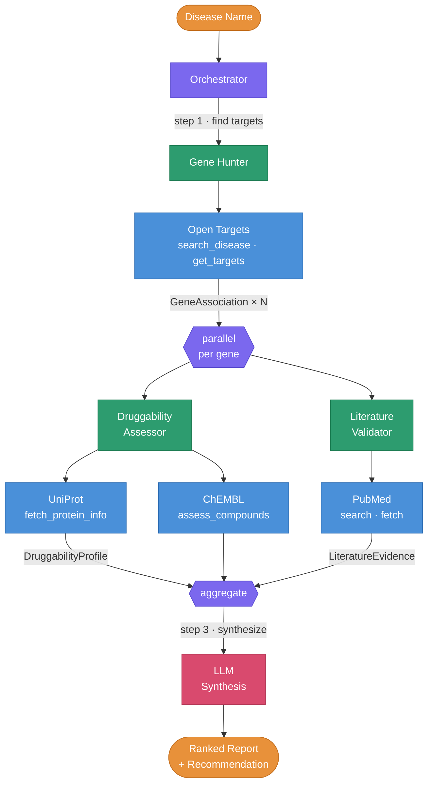

# Drug Target Reconnaissance Agent

A multi-agent system that autonomously identifies and ranks drug targets for a given disease. Takes a disease name, queries public bioinformatics databases, and produces a ranked report with druggability assessments and literature evidence. [See the full blog post.](blog-post.md)


**Run the pipeline to generate a report:**
```uv run python -m src.orchestrator "Alzheimer disease"```

Example output: see [examples/alzheimers.md](examples/report-alzheimer-disease.md) for a pre-generated report.


## Architecture



### Why Agents?

Each agent has **different tools and reasoning**: 
- Gene Hunter queries genomics databases
- Druggability Assessor interprets protein structure and compound data
- Literature Validator reads and classifies paper abstracts
- Orchestrator decides how to integrate the different evidence across sources

This architecture is modular: adding a Clinical Trials agent or Pathway Analysis agent requires no changes to existing agents.

## Quick Start

```bash
git clone https://github.com/YOUR_USERNAME/drug-target-agent.git
cd drug-target-agent
cp .env.example .env
# Edit .env with your Google Gemini API key and a valid email for the NCBI API (no registration needed)
uv sync
uv run python -m src.orchestrator "Alzheimer disease"
```

## API Keys

| API | Key Required? | How to Get |
|-----|--------------|------------|
| Open Targets | No | Free, no registration |
| UniProt | No | Free, no registration |
| ChEMBL | No | Free, no registration |
| PubMed | Email only | Just set `NCBI_EMAIL` in `.env` |
| OpenAI | Yes | [platform.openai.com](https://platform.openai.com) |

## Project Structure

```
src/
├── orchestrator.py          # Main pipeline: sequential + parallel fan-out
├── models.py                # Pydantic models for structured outputs
├── agents/
│   ├── gene_hunter.py       # Finds disease-gene associations
│   ├── druggability.py      # Assesses target tractability
│   └── literature.py        # Validates evidence in PubMed
└── tools/                   # Pure API wrappers (no LLM logic)
    ├── open_targets.py      # Open Targets GraphQL
    ├── uniprot.py           # UniProt REST
    ├── chembl.py            # ChEMBL REST
    └── pubmed.py            # NCBI E-utilities
```

## Testing

```bash
uv sync --extra dev
uv run pytest -v
```

All tests use mocked API responses (no live API calls required).

## Limitations & Next Steps

- Single association source: Only Open Targets for gene-disease links (could add GWAS Catalog, DisGeNET)
- Abstracts only: PubMed search uses abstracts, not full text
- No clinical trial data: Could add ClinicalTrials.gov agent
- Phase 2: Store results in a Neo4j/Kuzu knowledge graph for cross-disease target comparison and shared pathway discovery
