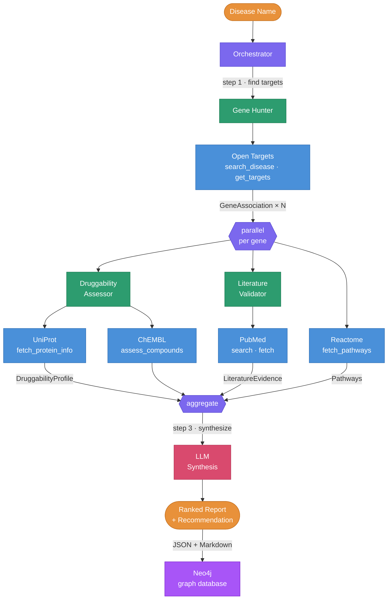

# Drug Target Reconnaissance Agent

A multi-agent system that autonomously identifies and ranks drug targets for a given disease. Takes a disease name, queries public bioinformatics databases, and produces a ranked report with druggability assessments and literature evidence. [See the full blog post.](blog-post.md)


**Run the pipeline to generate a report:**
```uv run python -m src.orchestrator "Alzheimer disease"```

Example output: see [reports/alzheimers.md](reports/report-alzheimer-disease.md) for a pre-generated report.


## Architecture



### Why Agents?

Each agent has **different tools and reasoning**:
- Gene Hunter queries genomics databases
- Druggability Assessor interprets protein structure and compound data
- Literature Validator reads and classifies paper abstracts
- Reactome tool fetches biological pathways each gene is involved in
- Orchestrator decides how to integrate the different evidence across sources

This architecture is modular: adding a Clinical Trials agent requires no changes to existing agents.

## Quick Start

```bash
git clone https://github.com/dariodata/drug-target-agent.git
cd drug-target-agent
cp .env.example .env
# Edit .env with your Google Gemini API key (GOOGLE_API_KEY, free tier is enough) and a valid email for the NCBI API (no registration needed)
uv sync
uv run python -m src.orchestrator "Alzheimer disease"
```

## API Keys

| API | Key Required? | How to Get |
|-----|--------------|------------|
| Open Targets | No | Free, no registration |
| UniProt | No | Free, no registration |
| ChEMBL | No | Free, no registration |
| Reactome | No | Free, no registration |
| PubMed | Email only | Just set `NCBI_EMAIL` in `.env` |
| OpenAI | Yes | [platform.openai.com](https://platform.openai.com) |
| Neo4j | Password | Local instance or [Neo4j Aura](https://neo4j.com/cloud/aura/) free tier |

## Project Structure

```
src/
├── orchestrator.py          # Main pipeline: sequential + parallel fan-out
├── models.py                # Pydantic models for structured outputs
├── neo4j_loader.py          # Ingest JSON reports into Neo4j
├── agents/
│   ├── gene_hunter.py       # Finds disease-gene associations
│   ├── druggability.py      # Assesses target tractability
│   └── literature.py        # Validates evidence in PubMed
└── tools/                   # Pure API wrappers (no LLM logic)
    ├── open_targets.py      # Open Targets GraphQL
    ├── uniprot.py           # UniProt REST
    ├── chembl.py            # ChEMBL REST
    ├── pubmed.py            # NCBI E-utilities
    └── reactome.py          # Reactome pathway search
```

## Testing

```bash
uv sync --extra dev
uv run pytest -v
```

All tests use mocked API responses (no live API calls required).

## Loading Reports into Neo4j

Each pipeline run produces a pair of files in `reports/`: a `.json` file (structured data) and a `.md` file (human-readable report). The JSON files can be ingested into a Neo4j graph database for cross-disease analysis.

### Prerequisites

1. A running Neo4j instance (local or remote)
2. Set the connection variables in `.env`:
   ```
   NEO4J_URI=bolt://localhost:7687
   NEO4J_USER=neo4j
   NEO4J_PASSWORD=your-password
   ```

### Ingest reports

```bash
# Load a single report
uv run python -m src.neo4j_loader reports/report-migraine.json

# Load all reports at once
uv run python -m src.neo4j_loader reports/
```

The loader creates the following graph schema:

```
(Disease)-[:ASSOCIATED_WITH]->(Gene)-[:ENCODES]->(Protein)-[:HAS_COMPOUND]->(Compound)
                                   `-[:MENTIONED_IN]->(Paper)
                                   `-[:INVOLVED_IN]->(Pathway)
(Report)-[:COVERS]->(Disease)
```

Uniqueness constraints are created automatically on first run (Disease.efo_id, Gene.ensembl_id, Protein.uniprot_acc, etc.), so running the loader multiple times is safe — existing nodes are merged, not duplicated.

## Limitations & Next Steps

- Single association source: Only Open Targets for gene-disease links (could add GWAS Catalog, DisGeNET)
- Abstracts only: PubMed search uses abstracts, not full text
- No clinical trial data: Could add ClinicalTrials.gov agent
- Neo4j web UI for querying the graph is planned
